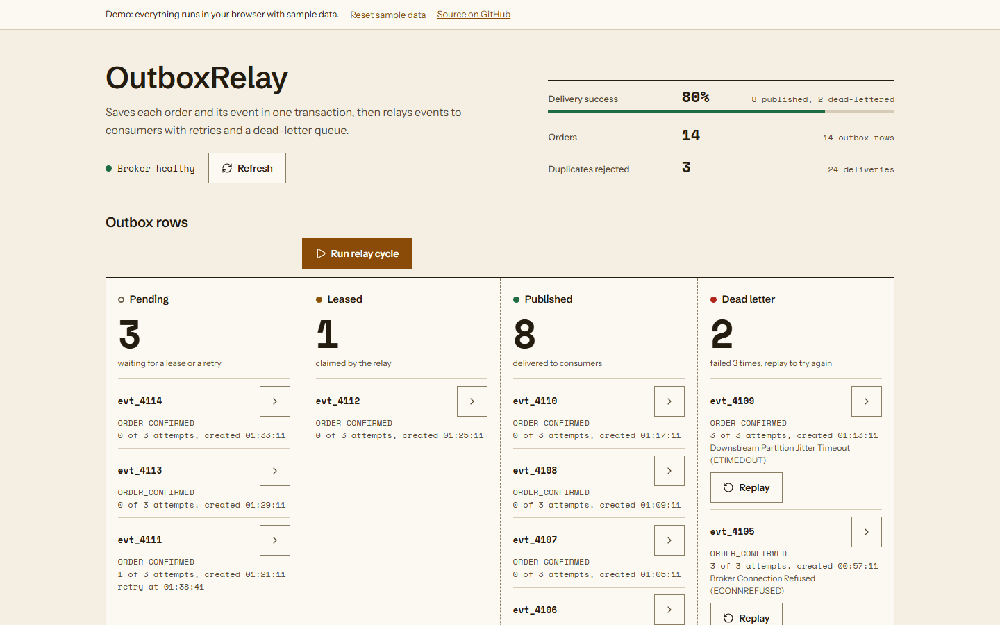

# OutboxRelay

OutboxRelay is a transactional outbox relay. It saves an order and its event in one database transaction, then a poller leases the pending events, hands them to a (simulated) message broker, retries failures with backoff, and moves events that keep failing to a dead-letter queue. A React console sorts the outbox rows into four lanes (pending, leased, published, dead letter) with a button to run a relay cycle at the boundary between the first two, and shows the consumers, an order form and a fault simulator for the broker.

It is meant for developers who want to see how the outbox pattern behaves, including what happens when the broker fails, a lease expires or a consumer sees the same event twice.

[](https://github.com/Taan1el/outboxrelay/actions/workflows/ci.yml)
[](https://github.com/Taan1el/outboxrelay/actions/workflows/pages.yml)
[](LICENSE)

**Live demo:** https://taan1el.github.io/outboxrelay/

The demo runs entirely in your browser. The same relay, backoff and validation code the server uses runs against an in-memory store with fixed sample data, so it works with no backend. Nothing is persisted; reload or use "Reset sample data" to start over.

## Screenshots



More screenshots: [the dead-letter lane and the lower panels](docs/screenshots/02-consumers-and-dead-letters.png), [the fault simulator after a full outage](docs/screenshots/03-fault-simulator.png), [the console at phone width](docs/screenshots/04-mobile.png).

## Features

- **Atomic write.** The order row and its outbox row are inserted in one SQLite transaction (`BEGIN IMMEDIATE`); if either insert fails, neither is stored.
- **Row leasing.** A poller sets due rows to `LEASED` with a `leased_until` time. A lease that expires without an outcome makes the row due again.
- **Retries with backoff.** A failed delivery is retried after 2 seconds, then 4 seconds. The third failed attempt moves the event to `DEAD_LETTER`.
- **Dead-letter queue.** Dead-lettered events keep their last error and can be replayed, which resets their attempts.
- **Consumer inbox.** Each consumer records `(event id, consumer)` once. A repeated delivery is counted and ignored.
- **Fault simulator.** Switch the broker between healthy, partial failures (half of the deliveries fail) and full outage, and set the delivery latency.
- **Browser demo** for GitHub Pages with a demo bar and a reset control.

## Delivery guarantees

Delivery is **at-least-once**, not exactly-once.

- A committed order always has its outbox row, because both are written in one transaction.
- A row is marked `PUBLISHED` only after the simulated broker accepted it. If the process stops after the broker accepted a message but before the row is updated, the row stays `LEASED`.
- A leased row becomes due again when `leased_until` has passed (5 seconds by default, 1 to 300 through the poll endpoint). The next cycle delivers it again. The same happens if a delivery takes longer than the lease.
- Because of that, a consumer can receive an event twice. The consumer inbox ignores the repeat, so the effect of an event is applied once as long as the consumer records the inbox entry and does its own work in one transaction. The simulated consumers here only write the inbox entry.
- Leasing runs in a transaction, so two cycles in one process, or two processes sharing the database file, do not lease the same row at the same time.

## Getting started

### Prerequisites
- Node.js 22.13 or newer (built and tested on Node.js 24.14.1; the server uses `node:sqlite`)
- npm 10 or newer

### Install and run
```bash
git clone https://github.com/Taan1el/outboxrelay.git
cd outboxrelay
npm install
npm run dev
```
This starts the Express server on port 4003 and the Vite dev server on port 5173. Open **http://localhost:5173**. The server creates `data/outbox.db` with two sample orders on first start.

### Environment variables
No variable is required for the defaults above.

| Variable | Used by | Default | Purpose |
|---|---|---|---|
| `PORT` | server | `4003` | Port the Express server listens on. See `server/.env.example`. |
| `OUTBOXRELAY_DB_PATH` | server | `data/outbox.db` at the repository root | SQLite database file. |
| `POLL_INTERVAL_MS` | server | `2500` | Milliseconds between automatic relay cycles (minimum 100). |
| `VITE_API_TARGET` | client (dev only) | `http://localhost:4003` | Where the Vite dev server proxies `/api`. See `client/.env.example`. |

The server does not load `.env` files itself; export the variables or start Node with `--env-file`.

### Scripts
| Script | What it does |
|---|---|
| `npm run dev` | Server and Vite dev server together |
| `npm run lint` | Type-checks server and client (`tsc --noEmit`) |
| `npm test` | Server tests, then client tests |
| `npm run build` | Compiles the server to `server/dist` and builds the client to `client/dist` |
| `npm run build:pages` | Builds the client in demo mode with base path `/outboxrelay/` |
| `npm start --workspace=server` | Runs the compiled server (after `npm run build`); it also serves `client/dist` |

## How it works

```
POST /api/orders
  BEGIN IMMEDIATE
    INSERT orders
    INSERT outbox_events (status PENDING)
  COMMIT

relay cycle (every 2.5 s, or POST /api/outbox/poll)
  lease due rows        PENDING and due, or LEASED with an expired lease
  for each row
    broker accepts   -> PUBLISHED, one consumer_inbox row per consumer
    broker fails     -> retry_count + 1
                          1st or 2nd failure: PENDING, available_at = now + 2 s / 4 s
                          3rd failure:        DEAD_LETTER
```

Decisions are written up in [`docs/adr/`](docs/adr/): [ADR-001 transactional outbox](docs/adr/001-transactional-outbox-dual-write-atomicity.md), [ADR-002 row leasing and backoff](docs/adr/002-row-leasing-poller-and-exponential-backoff.md), [ADR-003 consumer inbox and dead-letter queue](docs/adr/003-idempotent-consumer-inbox-and-dead-letter-triage.md).

### Project layout
```
shared/    logic used by both the server and the browser demo
             types.ts, outbox-logic.ts (backoff, validation, leasing rules),
             relay.ts (one relay cycle), in-memory-outbox.ts, demo-seed.ts
server/    Express API and SQLite store
  src/db, src/services, src/controllers, src/routes, src/lib
  test/    route, validation, store and parity tests
client/    React 19 console (Vite)
  src/components, src/services (api.ts, demoApi.ts, index.ts), src/styles, src/test
docs/      ADRs and screenshots
```

The in-memory store used by the demo and the SQLite store are checked against each other in `server/test/store.test.ts`: the same operations must leave both in the same state.

## API reference

All responses are `{ "success": true, "data": ... }` or `{ "success": false, "error": "..." }`. Invalid input returns `400` and changes nothing; unexpected errors return `500` with a generic message.

| Method | Endpoint | Description |
|---|---|---|
| `GET` | `/api/health` | Status, order count, pending count, success rate, broker mode |
| `GET` | `/api/stats` | Event counts by status, order count, consumer counts (`consumers`), success rate, broker mode |
| `GET` | `/api/orders` | The 50 most recent orders |
| `POST` | `/api/orders` | Save an order and its outbox event |
| `GET` | `/api/outbox/events` | The 100 most recent outbox rows; optional `?status=PENDING`, `LEASED`, `PUBLISHED`, `DEAD_LETTER` or `ALL` |
| `POST` | `/api/outbox/poll` | Run one relay cycle |
| `POST` | `/api/outbox/events/:id/retry` | Replay a dead-lettered event (`404` if it is not dead-lettered) |
| `GET` | `/api/consumer/inbox` | The 50 most recent consumer inbox entries |
| `POST` | `/api/broker/fault-config` | Set the simulated broker state |

Request bodies:

- `POST /api/orders`: `{ "customerId": "cust_1", "items": [{ "name": "Pack", "quantity": 2, "unitPriceEur": 12.5 }], "currency": "EUR" }`. `quantity` is an integer from 1 to 1000, `unitPriceEur` a number from 0 to 1,000,000, `currency` an optional three-letter uppercase code.
- `POST /api/outbox/poll`: optional `batchSize` (integer 1 to 100, default 10) and `leaseSeconds` (integer 1 to 300, default 5).
- `POST /api/broker/fault-config`: optional `mode` (`HEALTHY`, `PARTIAL_FAILURES`, `FULL_OUTAGE`), `failureRatePercent` (0 to 100, used by `PARTIAL_FAILURES`, default 50) and `simulatedLatencyMs` (0 to 5000).

The API has no authentication.

## Testing

```bash
npm test
```

- **Server** (Vitest and Supertest): routes and validation, transaction rollback, leasing and lease expiry, backoff timing, dead-lettering and replay, the consumer inbox, a migration from a database without `available_at`, the background poller, path resolution, and parity between the SQLite and in-memory stores.
- **Client** (Vitest and React Testing Library): the tally, the four lanes with their row counts, the show-all toggle, the dead-letter replay, the order form, the fault simulator, error handling, the refresh timer, the browser demo API and the demo bar.
- **Accessibility** (axe-core through vitest-axe): the suite includes automated accessibility checks for the lanes, the orders and consumers panels, the fault simulator and an opened row detail, using the WCAG 2 A and AA rules. jsdom cannot compute colors, so color contrast is checked outside jsdom.

Tests that depend on time use fake timers; none of them sleep.

## Deployment

### Docker
```bash
docker compose up --build
```
The image builds the server and the client, runs as the unprivileged `node` user and serves both on **http://localhost:4003**. The database lives in `/app/data`, which Compose mounts as a named volume. The Dockerfile is built in CI but not run there, so run the container once yourself before relying on it.

### GitHub Pages
`.github/workflows/pages.yml` builds the demo with `npm run build:pages` and deploys it with GitHub Pages when the repository is public. The base path is `/outboxrelay/`.

## Design notes and limitations

- The broker and the three consumers (`consumer-notifications`, `consumer-inventory`, `consumer-analytics`) are simulated inside the server process. There is no connection to Kafka, RabbitMQ or any other real broker.
- SQLite is a single file. The outbox here suits one node; it is not a distributed outbox, and a shared file on a network filesystem is not supported.
- Leases and backoff use the wall clock, so a large clock change on the host shifts them.
- Events whose retries are exhausted wait in the dead-letter queue until someone replays them.
- Consumer inbox rows and published outbox rows are never pruned.
- The console polls the API every 2.5 seconds; it does not use push updates.
- No performance figures are claimed. The project has not been benchmarked.
- The interface follows a plain, light design: one amber-brown accent, status shown as a dot plus a label, self-hosted fonts, no gradients or shadows.

## Roadmap

- A real broker adapter behind the same relay interface.
- Pruning for published rows and consumer inbox entries.
- Authentication for the API.
- Metrics for cycle duration and queue age.

## License

MIT. See [LICENSE](LICENSE).
