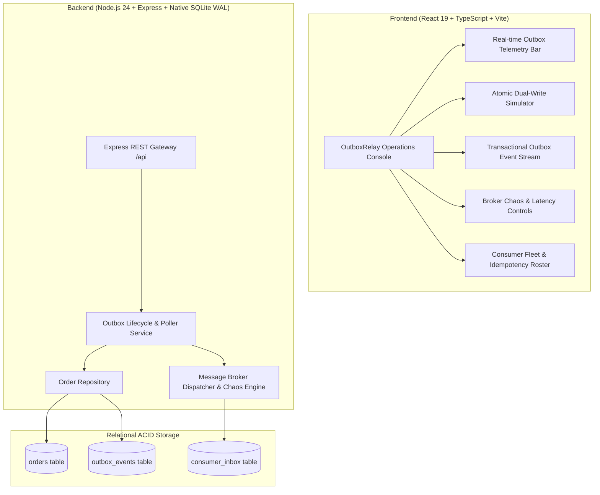

# OutboxRelay 📦🔄
> **Transactional Outbox Pattern, Atomicity Dual-Write Engine & Exactly-Once Event Broker**  
> *Engineered for Zero Data Loss, Row-Leased Poller Execution, Downstream Idempotency & Fault-Tolerant Dead-Letter Recovery*

[](#)
[](#)
[](#)
[-003B57.svg?style=flat-square)](#)
[](#)
[](#)
[](#)

---

## ⚡ 2-Minute Overview
**OutboxRelay** is an enterprise-grade Transactional Outbox Pattern engine and reliable event broker modeled after mission-critical architectures at fintechs and high-scale European unicorns (Wise, Adyen, Bolt, Pipedrive). It solves the classic distributed **Dual-Write Problem**—where database mutations and asynchronous message broker publishes can fail independently, leaving systems in inconsistent states.

### Core Capabilities
1. **Atomic Dual-Write Guarantee**: Persists domain entity mutations (`orders`) and event records (`outbox_events`) within a single native SQLite ACID transaction (`BEGIN IMMEDIATE`). If either fails, the entire transaction rolls back, guaranteeing zero dual-write discrepancy.
2. **Row-Leasing Asynchronous Poller**: Leases pending events using monotonic timestamps (`leased_until = now + 5s`), preventing multiple concurrent worker nodes from redundant processing while automatically reclaiming orphaned events if a worker crashes.
3. **Resilient Retry & Dead-Letter Queue (DLQ)**: Retries transient network failures using exponential backoff. Poison-pill events that fail 3 times are safely isolated to `DEAD_LETTER` with exact error diagnostics, unblocking the pipeline.
4. **End-to-End Exactly-Once Business Semantics**: Downstream consumers track event processing via an inbox deduplication ledger (`consumer_inbox`), gracefully filtering out duplicate deliveries caused by network retries.
5. **Interactive Chaos & Fault Simulator**: Engineer playground to inject broker faults (50% jitter or 100% outage) and observe real-time backoff, row leasing release, and DLQ trapping.
6. **Zero External Runtime Dependencies**: Powered by Node.js 24 native SQLite (`DatabaseSync` in WAL mode), offering instant local developer setup without mandatory Docker or external message queues.

---

## 🏛️ System Architecture



---

## ⚔️ The Dual-Write Problem vs. Transactional Outbox

```
Naive Dual-Write (Risky):
[API Endpoint] ──1. Save to Database──> [DB OK]
        │
        └──2. Publish to Kafka ──> ❌ [Network Partition / Broker Crash]
Result: Database updated, but event lost forever. Data inconsistency across microservices.

Transactional Outbox (Guaranteed):
[API Endpoint] ──1. BEGIN TRANSACTION────────────────────────┐
                         ├─ INSERT INTO orders                │ (Atomic Commit)
                         └─ INSERT INTO outbox_events         │
               ──2. COMMIT TRANSACTION────────────────────────┘
Result: 100% guaranteed persistence.
[Background Relayer] ──3. Leases pending events ──> 4. Delivers to Broker ──> 5. Marks PUBLISHED
```

---

## 🛠️ Tech Stack & Engineering Standards

| Layer | Technology | Rationale |
|---|---|---|
| **Runtime** | Node.js 24 (ES Modules) | High-performance asynchronous runtime with native SQLite & timers |
| **Language** | TypeScript 5.8 (Strict Mode) | Full-stack end-to-end type contracts between database, API, and UI |
| **Backend Framework** | Express 4.21 | Clean REST architecture with modular controllers and routers |
| **Database** | Native SQLite (`DatabaseSync`) | Zero-config ACID persistence with Write-Ahead Logging (WAL) |
| **Frontend** | React 19 + Vite 6 | Modern component hierarchy with fast HMR and sub-second builds |
| **Styling** | Modern CSS Variables & Design Tokens | Dark-mode terminal-inspired theme with responsive mobile/desktop layouts |
| **Testing** | Vitest 3.0 + React Testing Library | Unit tests for atomic transactions and integration tests for API |
| **Containerization** | Docker Multi-Stage + Compose | Production alpine container with unprivileged non-root runner |
| **Architecture** | ADRs (`docs/adr/`) | Recorded decisions on atomicity, row leasing, and consumer deduplication |

---

## 🔌 REST API Reference

| Method | Endpoint | Description |
|---|---|---|
| `GET` | `/api/health` | Broker health, active orders, and delivery success rate |
| `GET` | `/api/stats` | Telemetry: total events, published, leased, dead-letter, deduplicated |
| `GET` | `/api/orders` | List recent committed orders |
| `POST` | `/api/orders` | Commit new order with atomic outbox event |
| `GET` | `/api/outbox/events` | Stream outbox events (optional `?status=PENDING/DEAD_LETTER`) |
| `POST` | `/api/outbox/poll` | Manually trigger outbox relay poller cycle |
| `POST` | `/api/outbox/events/:id/retry` | Replay dead-lettered event (resets to `PENDING`) |
| `GET` | `/api/consumer/inbox` | Audit log of downstream consumer dispatches and deduplication |
| `POST` | `/api/broker/fault-config` | Inject broker chaos (`HEALTHY`, `PARTIAL_FAILURES`, `FULL_OUTAGE`) |

---

## 💻 Quickstart Guide (Zero-Config)

### Prerequisites
- Node.js 22+ (tested on Node.js 24)
- npm 10+

### 1. Installation
```bash
git clone https://github.com/Taan1el/outboxrelay.git
cd outboxrelay
npm install
```

### 2. Run Development Environment
```bash
# Concurrently starts backend API (port 4003) and Vite frontend (port 5173)
npm run dev
```
Open **http://localhost:5173** to view the live OutboxRelay operations console.

### 3. Run Automated Tests & Quality Checks
```bash
# Run backend ACID transaction & poller tests
npm run test:server

# Run frontend UI component tests
npm run test:client

# Run full test suite across workspace
npm test

# Typecheck and lint
npm run lint

# Production build verification
npm run build
```

---

## 🐳 Docker Deployment

Run the containerized event broker with Docker Compose:
```bash
docker compose up --build
```
OutboxRelay will be accessible at **http://localhost:4003**.

---

## 📜 Architecture Decision Records (ADRs)

Key architectural decisions are documented under [`docs/adr/`](./docs/adr/):
- [ADR-001: Transactional Outbox Pattern for Dual-Write Atomicity](./docs/adr/001-transactional-outbox-dual-write-atomicity.md)
- [ADR-002: Row Leasing Poller with Monotonic Timeouts and Exponential Backoff](./docs/adr/002-row-leasing-poller-and-exponential-backoff.md)
- [ADR-003: Idempotent Consumer Inbox and Dead-Letter Queue (DLQ) Triage](./docs/adr/003-idempotent-consumer-inbox-and-dead-letter-triage.md)

---

## 📄 License
MIT License. Built for technical demonstration and high-scale production architectures.